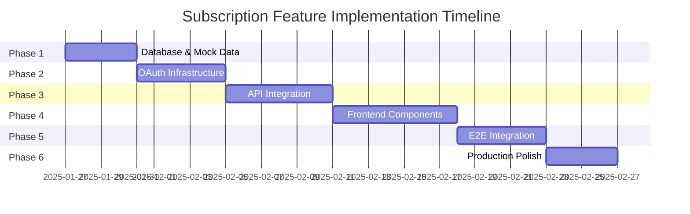

# Subscription Feature Implementation Plan

**Based on PRD:** Multi-Subscription Content Feeds (Phase 1: Spotify Podcasts & YouTube Channels)  
**Created:** July 27, 2025

---

## Phase 1: Database Schema & Backend Infrastructure

### 1.1 Database Schema Changes
**File:** `packages/api/src/schema.ts`

```sql
-- New tables required:
CREATE TABLE connected_accounts (
  id TEXT PRIMARY KEY,
  user_id TEXT NOT NULL,
  service TEXT NOT NULL, -- 'spotify' | 'youtube'
  access_token TEXT NOT NULL,
  refresh_token TEXT,
  expires_at INTEGER,
  created_at INTEGER NOT NULL,
  updated_at INTEGER NOT NULL,
  FOREIGN KEY (user_id) REFERENCES users(id),
  UNIQUE(user_id, service) -- Only one account per service per user
);

CREATE TABLE subscriptions (
  id TEXT PRIMARY KEY,
  user_id TEXT NOT NULL,
  connected_account_id TEXT NOT NULL,
  external_id TEXT NOT NULL, -- Spotify show ID or YouTube channel ID
  title TEXT NOT NULL,
  creator_name TEXT NOT NULL,
  thumbnail_url TEXT,
  is_active BOOLEAN DEFAULT true,
  created_at INTEGER NOT NULL,
  updated_at INTEGER NOT NULL,
  FOREIGN KEY (user_id) REFERENCES users(id),
  FOREIGN KEY (connected_account_id) REFERENCES connected_accounts(id),
  UNIQUE(connected_account_id, external_id)
);

CREATE TABLE subscription_items (
  id TEXT PRIMARY KEY,
  subscription_id TEXT NOT NULL,
  external_id TEXT NOT NULL, -- Episode/video ID
  title TEXT NOT NULL,
  description TEXT,
  thumbnail_url TEXT,
  duration INTEGER, -- in seconds
  published_at INTEGER NOT NULL,
  status TEXT DEFAULT 'unread', -- 'unread' | 'read'
  bookmark_id TEXT, -- Reference to bookmark if saved
  created_at INTEGER NOT NULL,
  updated_at INTEGER NOT NULL,
  FOREIGN KEY (subscription_id) REFERENCES subscriptions(id),
  FOREIGN KEY (bookmark_id) REFERENCES bookmarks(id),
  UNIQUE(subscription_id, external_id)
);
```

### 1.2 API Endpoints
**File:** `packages/api/src/routes/subscriptions.ts`

```typescript
// OAuth & Account Management
POST /api/v1/auth/spotify/connect
POST /api/v1/auth/youtube/connect
DELETE /api/v1/auth/:service/disconnect
GET /api/v1/auth/connected-accounts

// Subscription Management
GET /api/v1/subscriptions/discover/:service  // Get available podcasts/channels
POST /api/v1/subscriptions                   // Subscribe to show/channel
DELETE /api/v1/subscriptions/:id             // Unsubscribe
GET /api/v1/subscriptions                    // Get user's subscriptions
PUT /api/v1/subscriptions/:id/toggle         // Enable/disable subscription

// Feed Items
GET /api/v1/feed                             // Get unread items across all subscriptions
GET /api/v1/feed/:subscriptionId             // Get items for specific subscription
PUT /api/v1/feed/items/:id/read              // Mark item as read
POST /api/v1/feed/items/:id/bookmark         // Save item as bookmark
```

### 1.3 Background Jobs
**File:** `packages/api/src/jobs/polling.ts`

```typescript
// Scheduled Worker for polling external APIs
- Spotify Web API integration for podcast episodes
- YouTube Data API v3 integration for channel videos
- Exponential backoff on failures
- Token refresh handling
- Rate limit management
```

---

## Phase 2: Frontend Components & User Experience

### 2.1 New Pages/Routes
**Files:** `apps/web/src/routes/`

```typescript
// Route structure
/feed                    // Main subscription feed (stories UI)
/feed/$subscriptionId    // Individual subscription items
/settings/subscriptions  // Manage subscriptions
/auth/connect/:service   // OAuth connection flow
```

### 2.2 Core Components
**Files:** `apps/web/src/components/`

```typescript
// Feed Components
<SubscriptionFeed />           // Main stories-style horizontal avatars
<SubscriptionAvatar />         // Individual subscription circle
<ItemsList />                  // Vertical list of unread items
<ItemPreview />               // Individual item preview card
<SaveToZineButton />          // Bookmark action button

// Setup Components  
<AccountConnector />          // OAuth connection UI
<SubscriptionSelector />      // Initial setup checklist
<ManageSubscriptions />       // Toggle subscriptions on/off

// Utility Components
<EmptyFeedState />           // "All caught up" message
<ConnectionStatus />         // Auth error banners
<LoadingStates />           // Loading skeletons
```

### 2.3 Custom Hooks
**Files:** `apps/web/src/hooks/`

```typescript
// Data fetching hooks using TanStack Query
useConnectedAccounts()       // Get user's connected accounts
useSubscriptions()           // Get user's subscriptions  
useFeedItems()              // Get unread feed items
useDiscoverContent()        // Get available podcasts/channels to subscribe
useMarkAsRead()             // Mark item as read mutation
useSaveBookmark()           // Save item as bookmark mutation
useToggleSubscription()     // Enable/disable subscription mutation
```

---

## Phase 3: OAuth Integration

### 3.1 Spotify Integration
**Files:** `packages/api/src/services/spotify.ts`

```typescript
// Spotify Web API integration
- OAuth 2.0 PKCE flow
- Scopes: user-read-playback-position, user-library-read
- Endpoints: /me/shows, /shows/{id}/episodes
- Podcast-only filtering (exclude music)
- Token refresh automation
```

### 3.2 YouTube Integration  
**Files:** `packages/api/src/services/youtube.ts`

```typescript
// YouTube Data API v3 integration
- OAuth 2.0 flow
- Scopes: youtube.readonly
- Endpoints: /subscriptions, /channels, /search
- Channel videos retrieval
- Quota management (10,000 units/day)
```

### 3.3 OAuth Security
**Files:** `packages/api/src/middleware/auth.ts`

```typescript
// Security considerations
- PKCE for mobile/SPA security
- Secure token storage in D1
- Token encryption at rest
- Automatic token refresh
- Scope validation
- Rate limiting per user
```

---

## Phase 4: Shared Services & Business Logic

### 4.1 Repository Pattern Extensions
**Files:** `packages/shared/src/`

```typescript
// New repository interfaces
interface SubscriptionRepository {
  getByUserId(userId: string): Promise<Subscription[]>
  create(subscription: CreateSubscription): Promise<Subscription>
  delete(id: string): Promise<void>
  toggleActive(id: string, active: boolean): Promise<void>
}

interface FeedRepository {
  getUnreadItems(userId: string): Promise<FeedItem[]>
  getItemsBySubscription(subscriptionId: string): Promise<FeedItem[]>
  markAsRead(itemId: string): Promise<void>
  createFromExternal(item: ExternalItem): Promise<FeedItem>
}
```

### 4.2 Service Layer
**Files:** `packages/shared/src/services/`

```typescript
// Business logic services
class SubscriptionService {
  async connectAccount(userId: string, service: string, tokens: OAuthTokens)
  async discoverContent(userId: string, service: string)
  async subscribe(userId: string, externalId: string)
  async getSubscriptions(userId: string)
  async syncNewContent(subscription: Subscription)
}

class FeedService {
  async getFeedItems(userId: string, filter?: 'unread' | 'all')
  async markItemAsRead(itemId: string)
  async saveItemAsBookmark(itemId: string, userId: string)
}
```

---

## Phase 5: UI/UX Implementation

### 5.1 Stories-Style Feed Design
```typescript
// Horizontal scrollable avatar bar
- Circular avatars with subscription thumbnails
- Ordered by most recent content (left to right)
- Unread indicator (badge/dot)
- Smooth horizontal scroll
- Loading states for each avatar
```

### 5.2 Item Preview Cards
```typescript
// Vertical swipeable item list
- Hero thumbnail
- Title, creator, publish date, duration
- Description preview (truncated)
- "Save to Zine" prominent button
- Visual "already bookmarked" state
- Swipe gestures for navigation
```

### 5.3 Onboarding Flow
```typescript
// Multi-step setup process
1. Service selection (Spotify/YouTube)
2. OAuth connection
3. Subscription selector with search/filter
4. Success confirmation
5. First feed view tutorial
```

---

## Phase 6: Performance & Monitoring

### 6.1 Performance Requirements
- Feed load ≤ 2s for 25 subscriptions / 200 items
- Optimistic UI updates for read/bookmark actions
- Infinite scroll for large subscription lists
- Image lazy loading and caching
- Background sync when app is closed

### 6.2 Error Handling
- OAuth token expiry recovery
- API rate limit handling
- Network connectivity issues
- Graceful degradation for missing data
- User-friendly error messages

### 6.3 Analytics & Monitoring
- Track subscription adoption rates
- Monitor feed engagement metrics
- API performance and error rates
- User flow completion rates
- Background job success rates

---

## Implementation Order

1. **Week 1-2:** Database schema, basic API endpoints, OAuth setup
2. **Week 3-4:** Spotify/YouTube service integration, polling jobs
3. **Week 5-6:** Frontend components, routing, basic UI
4. **Week 7-8:** Stories UI, item previews, save functionality  
5. **Week 9-10:** Onboarding flow, subscription management
6. **Week 11-12:** Polish, performance optimization, testing

---

## Success Criteria Checklist

- [ ] Users can connect Spotify and YouTube accounts
- [ ] Subscription selector shows available content
- [ ] Feed updates automatically via background polling
- [ ] Stories UI displays subscriptions by recent activity
- [ ] Items can be marked as read and saved as bookmarks
- [ ] Manage subscriptions allows enable/disable
- [ ] Performance meets 2s load time requirement
- [ ] Error handling for OAuth and API failures
- [ ] 20% of bookmarks come from feed within 30 days
- [ ] 10% increase in DAU within 30 days

---

## Revised Independent Implementation Plan

**Problem with Original Phases:** Dependencies prevent true independent implementation and verification.

### Enhanced Independent Phase Structure

#### **Phase 1: Database Foundation + Mock Data**
**Deliverable:** Working API with comprehensive mock data and full test coverage
**Duration:** 3-4 days

**Implementation Details:**
- Database schema migrations with proper foreign key constraints
- API endpoints with structured mock responses
- Comprehensive seed data covering edge cases
- API documentation with examples
- Repository pattern implementation

**Mock Data Strategy:**
```typescript
// Mock data examples for independent testing
const mockSubscriptions = [
  {
    id: "sub_1",
    userId: "user_123",
    connectedAccountId: "acc_spotify_1",
    externalId: "spotify_show_abc",
    title: "The Daily Tech Podcast",
    creatorName: "Tech News Inc",
    thumbnailUrl: "https://example.com/thumb1.jpg",
    isActive: true,
    unreadCount: 5
  }
];

const mockFeedItems = [
  {
    id: "item_1",
    subscriptionId: "sub_1", 
    externalId: "episode_xyz",
    title: "AI Breakthrough in 2025",
    description: "Latest developments in AI technology...",
    publishedAt: 1674505200,
    duration: 1800,
    status: "unread"
  }
];
```

**Independent Verification:**
```bash
# 1. Database setup and migration
bun run db:migrate
bun run db:seed-mock-data

# 2. API endpoint testing
curl /api/v1/subscriptions | jq .  # Returns 10+ mock subscriptions
curl /api/v1/feed | jq .           # Returns 50+ mock feed items
curl /api/v1/feed/unread | jq .    # Returns filtered unread items

# 3. CRUD operations
curl -X POST /api/v1/subscriptions -d '{"externalId":"test_123"}'
curl -X PUT /api/v1/subscriptions/sub_1/toggle
curl -X DELETE /api/v1/subscriptions/sub_1

# 4. Test suite
bun run test:api              # 95%+ test coverage
bun run test:db-migrations    # Schema validation
bun run test:mock-data        # Data integrity checks

# 5. Performance baseline
bun run benchmark:api         # <100ms response times
```

**Rollback Plan:**
```bash
# Clean rollback procedure
bun run db:rollback-migration
git checkout HEAD~1 -- packages/api/src/schema.ts
bun run build && bun run test
```

#### **Phase 2: OAuth Infrastructure + Test Accounts**
**Deliverable:** Production-ready OAuth flows with comprehensive security
**Duration:** 4-5 days

**Implementation Details:**
- PKCE OAuth 2.0 flows for enhanced security
- Encrypted token storage with rotation
- Automatic token refresh with exponential backoff
- Rate limiting and abuse prevention
- Comprehensive error handling and user feedback

**Security Implementation:**
```typescript
// OAuth security configuration
const oauthConfig = {
  spotify: {
    clientId: process.env.SPOTIFY_CLIENT_ID,
    scopes: ['user-read-playback-position', 'user-library-read'],
    usesPKCE: true,
    tokenEncryption: 'AES-256-GCM',
    refreshThreshold: 300 // seconds before expiry
  },
  youtube: {
    clientId: process.env.YOUTUBE_CLIENT_ID,
    scopes: ['https://www.googleapis.com/auth/youtube.readonly'],
    usesPKCE: true,
    tokenEncryption: 'AES-256-GCM',
    quotaManagement: true
  }
};

// Token refresh strategy
class TokenManager {
  async refreshToken(accountId: string): Promise<TokenResult> {
    // Exponential backoff on failures
    // Secure token rotation
    // Audit logging
  }
}
```

**Test Account Strategy:**
```bash
# Developer test accounts setup
SPOTIFY_TEST_ACCOUNT="zine-dev-spotify@example.com"
YOUTUBE_TEST_ACCOUNT="zine-dev-youtube@example.com"

# Mock OAuth responses for CI/CD
MOCK_OAUTH_RESPONSES="enabled"
OAUTH_SIMULATION_MODE="test"
```

**Independent Verification:**
```bash
# 1. OAuth flow testing (automated)
bun run test:oauth-flows              # Test all OAuth scenarios
bun run test:oauth-security           # PKCE, state validation
bun run test:token-refresh            # Auto-refresh mechanisms

# 2. Manual OAuth verification
# Visit: http://localhost:3000/auth/connect/spotify
# - Redirects to Spotify OAuth
# - User grants permissions
# - Successfully redirects back with code
# - Token exchange completes
# - Tokens encrypted and stored in DB

# 3. Token management testing
bun run test:token-expiry             # Simulate token expiry
bun run test:token-rotation           # Verify refresh works
bun run test:oauth-disconnect         # Clean disconnection

# 4. Security testing
bun run test:oauth-attacks            # CSRF, state manipulation
bun run test:rate-limiting            # OAuth endpoint limits
bun run test:token-encryption         # Verify encryption at rest

# 5. Error handling verification
curl /api/v1/auth/invalid-state       # Returns proper error
curl /api/v1/auth/expired-token       # Triggers refresh
```

**Error Scenarios Covered:**
- Invalid OAuth state/CSRF attacks
- Expired refresh tokens
- Revoked user permissions
- API rate limit exceeded
- Network timeouts during OAuth
- Malformed OAuth responses

**Rollback Plan:**
```bash
# Disable OAuth endpoints
bun run feature-flag:disable-oauth
# Revert OAuth middleware
git checkout HEAD~1 -- packages/api/src/middleware/auth.ts
# Clear test tokens
bun run db:clear-oauth-tokens
```

#### **Phase 3: External API Integration + Smart Caching**
**Deliverable:** Production-ready API integration with intelligent caching
**Duration:** 5-6 days

**Implementation Details:**
- Spotify Web API integration with podcast filtering
- YouTube Data API v3 with quota optimization
- Multi-tier caching strategy (memory + database + CDN)
- Background polling with intelligent scheduling
- Circuit breaker pattern for API failures
- Comprehensive rate limiting with backoff

**API Integration Strategy:**
```typescript
// Service architecture with caching
class SpotifyService {
  private cache = new Redis();
  private rateLimiter = new RateLimiter(100, '1m'); // Spotify limits
  
  async getShows(userId: string): Promise<Show[]> {
    // 1. Check memory cache (5 min TTL)
    // 2. Check database cache (1 hour TTL)
    // 3. Fetch from Spotify API
    // 4. Update all cache layers
  }
  
  async getEpisodes(showId: string): Promise<Episode[]> {
    // Intelligent polling: more frequent for active shows
    const pollingInterval = this.calculatePollingInterval(showId);
    return this.fetchWithRetry('/shows/{id}/episodes');
  }
}

class YouTubeService {
  private quotaManager = new YouTubeQuotaManager(10000); // Daily limit
  
  async getChannelVideos(channelId: string): Promise<Video[]> {
    // Quota-optimized requests
    // Batch operations where possible
    // Fallback to RSS when quota exceeded
  }
}
```

**Caching Strategy:**
```typescript
// Multi-tier caching configuration
const cachingConfig = {
  memory: {
    ttl: 300,        // 5 minutes
    maxSize: 1000    // items
  },
  database: {
    ttl: 3600,       // 1 hour
    tableName: 'api_cache'
  },
  cdn: {
    ttl: 86400,      // 24 hours for static content
    enabled: true
  }
};

// Cache invalidation strategy
class CacheManager {
  async invalidateOnUpdate(key: string): Promise<void> {
    // Smart invalidation based on content freshness
    // Probabilistic cache warming
    // Background refresh for popular content
  }
}
```

**Background Polling Strategy:**
```typescript
// Intelligent polling scheduler
class PollingScheduler {
  async schedulePolling(subscription: Subscription): Promise<void> {
    const frequency = this.calculateFrequency({
      userActivity: subscription.lastAccessed,
      contentFrequency: subscription.avgPublishRate,
      priorityScore: subscription.engagementScore
    });
    
    // Dynamic intervals: 5min (high activity) to 6h (dormant)
    await this.scheduleJob(subscription.id, frequency);
  }
}
```

**Independent Verification:**
```bash
# 1. API integration testing
bun run test:spotify-api              # Real API calls with test account
bun run test:youtube-api              # Quota-aware testing
bun run test:api-circuit-breakers     # Failure simulation

# 2. Caching verification
bun run test:cache-layers             # Memory, DB, CDN caching
bun run test:cache-invalidation       # Smart invalidation
bun run benchmark:cache-performance   # <50ms cache hits

# 3. Rate limiting testing
bun run test:rate-limiting            # Spotify/YouTube limits
bun run test:quota-management         # YouTube quota tracking
bun run test:backoff-strategies       # Exponential backoff

# 4. Polling job testing
bun run test:polling-scheduler        # Dynamic frequency calculation
bun run test:background-jobs          # Job queue processing
bun run test:job-failure-recovery     # Error handling and retries

# 5. Performance testing
bun run benchmark:api-calls           # <2s for batch operations
bun run test:concurrent-requests      # Parallel API handling
bun run monitor:api-health            # Real-time API status

# 6. Data quality verification
curl /api/v1/test/spotify-data | jq .episodes[0]  # Verify data structure
curl /api/v1/test/youtube-data | jq .videos[0]   # Verify data quality
```

**API Quotas & Limits:**
```yaml
Spotify Web API:
  - Rate limit: 100 requests/minute
  - No daily quota limit
  - Podcast endpoints: /me/shows, /shows/{id}/episodes
  
YouTube Data API v3:
  - Rate limit: 10,000 units/day
  - Cost optimization: channels.list (1 unit), search (100 units)
  - Fallback: RSS feeds when quota exceeded
```

**Error Handling Scenarios:**
- API rate limit exceeded → exponential backoff + cache serving
- OAuth token expired → automatic refresh + retry
- API service downtime → circuit breaker + cached data
- Malformed API responses → data validation + fallback
- Network timeouts → retry with backoff + degraded service

**Rollback Plan:**
```bash
# Disable external API calls
bun run feature-flag:disable-external-apis
# Switch to cached data only
bun run cache:enable-fallback-mode
# Disable background polling
bun run jobs:pause-polling
# Revert API service changes
git checkout HEAD~1 -- packages/api/src/services/
```

#### **Phase 4: Frontend Components + Design System**
**Deliverable:** Production-ready UI with comprehensive design system
**Duration:** 6-7 days

**Implementation Details:**
- Stories-style feed with smooth animations
- Accessible, responsive component library
- Progressive Web App features
- Optimistic UI updates for instant feedback
- Comprehensive error boundaries and loading states
- Full keyboard navigation support

**Component Architecture:**
```typescript
// Core feed components with TypeScript
interface FeedProps {
  subscriptions: Subscription[];
  onSubscriptionSelect: (id: string) => void;
  loading?: boolean;
  error?: string;
}

const SubscriptionFeed: React.FC<FeedProps> = ({
  subscriptions,
  onSubscriptionSelect,
  loading,
  error
}) => {
  // Horizontal virtualized scrolling for performance
  // Intersection observer for lazy loading
  // Smooth scroll with momentum
  // Touch gestures for mobile
};

const SubscriptionAvatar: React.FC<AvatarProps> = ({
  subscription,
  unreadCount,
  isActive,
  onClick
}) => {
  // Animated unread badge
  // Loading shimmer states
  // Touch feedback
  // Accessibility labels
};

const ItemsList: React.FC<ItemsProps> = ({
  items,
  onItemRead,
  onItemBookmark
}) => {
  // Virtual scrolling for large lists
  // Swipe gestures for actions
  // Optimistic UI updates
  // Undo/redo functionality
};
```

**Design System Implementation:**
```typescript
// Consistent design tokens
const designTokens = {
  colors: {
    primary: 'hsl(220 100% 50%)',
    secondary: 'hsl(210 40% 90%)',
    accent: 'hsl(43 96% 56%)',
    destructive: 'hsl(0 84% 60%)',
    success: 'hsl(142 76% 36%)'
  },
  spacing: {
    xs: '0.25rem',
    sm: '0.5rem',
    md: '1rem',
    lg: '1.5rem',
    xl: '2rem'
  },
  animations: {
    duration: {
      fast: '150ms',
      normal: '250ms',
      slow: '350ms'
    },
    easing: 'cubic-bezier(0.16, 1, 0.3, 1)'
  }
};

// Component variants with class-variance-authority
const avatarVariants = cva(
  'relative flex items-center justify-center rounded-full transition-all',
  {
    variants: {
      size: {
        sm: 'w-12 h-12',
        md: 'w-16 h-16',
        lg: 'w-20 h-20'
      },
      state: {
        active: 'ring-2 ring-primary shadow-lg scale-105',
        inactive: 'opacity-75 hover:opacity-100',
        loading: 'animate-pulse bg-gray-200'
      }
    }
  }
);
```

**Accessibility Implementation:**
```typescript
// WCAG 2.1 AA compliance
const AccessibleFeedItem: React.FC<FeedItemProps> = ({ item }) => {
  return (
    <article
      role="article"
      aria-labelledby={`item-title-${item.id}`}
      aria-describedby={`item-desc-${item.id}`}
      tabIndex={0}
      onKeyDown={handleKeyNavigation}
    >
      <h3 id={`item-title-${item.id}`} className="sr-only">
        {item.title}
      </h3>
      <p id={`item-desc-${item.id}`} className="sr-only">
        {item.description}
      </p>
      <button
        aria-label={`Save "${item.title}" to bookmarks`}
        onClick={handleBookmark}
      >
        Save to Zine
      </button>
    </article>
  );
};

// Keyboard navigation support
const useKeyboardNavigation = () => {
  useEffect(() => {
    const handleKeyDown = (e: KeyboardEvent) => {
      switch (e.key) {
        case 'ArrowLeft': // Previous subscription
        case 'ArrowRight': // Next subscription
        case 'ArrowUp': // Previous item
        case 'ArrowDown': // Next item
        case 'Enter': // Select/bookmark
        case 'Escape': // Close/back
          // Handle navigation
      }
    };
  }, []);
};
```

**Performance Optimizations:**
```typescript
// Virtualization for large lists
import { FixedSizeList as List } from 'react-window';

const VirtualizedItemList: React.FC = ({ items }) => {
  const Row = memo(({ index, style }: ListChildComponentProps) => (
    <div style={style}>
      <FeedItem item={items[index]} />
    </div>
  ));
  
  return (
    <List
      height={600}
      itemCount={items.length}
      itemSize={120}
      overscanCount={5}
    >
      {Row}
    </List>
  );
};

// Image optimization
const OptimizedImage: React.FC<ImageProps> = ({ src, alt }) => {
  const [loaded, setLoaded] = useState(false);
  const imgRef = useRef<HTMLImageElement>(null);
  
  useEffect(() => {
    // Intersection Observer for lazy loading
    // WebP/AVIF format detection
    // Progressive JPEG loading
  }, []);
};
```

**Mock Data Integration:**
```typescript
// Comprehensive mock data for testing
const mockFeedData = {
  subscriptions: [
    {
      id: 'sub_1',
      title: 'Tech Daily',
      avatar: '/mock-avatars/tech-daily.jpg',
      unreadCount: 3,
      lastUpdated: '2025-01-27T10:00:00Z'
    }
  ],
  items: [
    {
      id: 'item_1',
      title: 'The Future of AI in 2025',
      description: 'Exploring breakthrough developments...',
      thumbnail: '/mock-thumbnails/ai-future.jpg',
      duration: 1800,
      publishedAt: '2025-01-27T08:00:00Z',
      creator: 'Tech Daily',
      isBookmarked: false
    }
  ]
};

// Mock API responses for frontend testing
const useMockSubscriptions = () => {
  return useQuery({
    queryKey: ['subscriptions'],
    queryFn: () => Promise.resolve(mockFeedData.subscriptions),
    staleTime: Infinity // Never refetch in mock mode
  });
};
```

**Independent Verification:**
```bash
# 1. Component testing with mock data
bun run dev                           # Start dev server
# Visit http://localhost:3000/feed → Stories UI renders
# Test horizontal scrolling → Smooth momentum
# Click subscription avatars → Item lists display
# Test swipe gestures → Item navigation works

# 2. Accessibility testing
bun run test:a11y                     # Automated accessibility tests
# Screen reader testing: NVDA/JAWS compatibility
# Keyboard navigation: Tab, Arrow keys, Enter, Escape
# Color contrast: 4.5:1 ratio verification

# 3. Performance testing
bun run test:performance              # Component render times
bun run benchmark:virtualization      # Large list handling
bun run test:animations               # 60fps animation verification
lighthouse http://localhost:3000/feed # Core Web Vitals

# 4. Responsive design testing
# Mobile (375px): Touch gestures, swipe navigation
# Tablet (768px): Hybrid touch/mouse interactions
# Desktop (1024px+): Keyboard shortcuts, hover states

# 5. Component library testing
bun run test:storybook               # Component isolation testing
bun run chromatic                    # Visual regression testing
bun run test:components              # Unit tests for all components

# 6. Integration testing
bun run test:bookmarks-integration   # "Save to Zine" functionality
bun run test:routing                 # TanStack Router integration
bun run test:state-management        # TanStack Query integration
```

**Progressive Web App Features:**
```typescript
// Service worker for offline support
const serviceWorkerConfig = {
  workbox: {
    runtimeCaching: [{
      urlPattern: /\/api\/v1\/feed/,
      handler: 'StaleWhileRevalidate',
      options: {
        cacheName: 'feed-cache',
        expiration: {
          maxEntries: 100,
          maxAgeSeconds: 3600
        }
      }
    }]
  }
};

// Install prompt for mobile
const useInstallPrompt = () => {
  const [deferredPrompt, setDeferredPrompt] = useState<any>(null);
  
  useEffect(() => {
    const handler = (e: Event) => {
      e.preventDefault();
      setDeferredPrompt(e);
    };
    window.addEventListener('beforeinstallprompt', handler);
  }, []);
};
```

**Rollback Plan:**
```bash
# Disable new feed routes
bun run feature-flag:disable-feed-ui
# Revert to bookmark-only interface
git checkout HEAD~1 -- apps/web/src/routes/feed/
# Remove new components
git checkout HEAD~1 -- apps/web/src/components/feed/
# Clear component cache
bun run clean && bun run build
```

#### **Phase 5: End-to-End Integration + Real Data**
**Deliverable:** Full-scale production integration with comprehensive monitoring
**Duration:** 4-5 days

**Implementation Details:**
- Real OAuth flows with production credentials
- Live API integration with full error handling
- Background sync with intelligent scheduling
- Real-time UI updates with WebSockets
- Complete user journey optimization
- Data consistency validation

**Integration Architecture:**
```typescript
// End-to-end data flow
class SubscriptionFlowOrchestrator {
  async initiateUserJourney(userId: string): Promise<void> {
    // 1. OAuth connection → Token storage
    // 2. API discovery → Subscription creation
    // 3. Background polling → Content sync
    // 4. UI notifications → User engagement
    // 5. Bookmark integration → Content saving
  }
  
  async handleRealTimeUpdates(): Promise<void> {
    // WebSocket connections for instant updates
    // Optimistic UI with conflict resolution
    // Background sync coordination
  }
}

// Data consistency validation
class DataIntegrityChecker {
  async validateUserData(userId: string): Promise<ValidationReport> {
    // Cross-reference external APIs with local data
    // Identify and resolve data inconsistencies
    // Generate integrity reports
  }
}
```

**Real Data Testing Strategy:**
```typescript
// Production-like test scenarios
const integrationTestScenarios = [
  {
    name: 'Heavy User Simulation',
    subscriptions: 25,
    itemsPerSubscription: 50,
    activePollingInterval: '5m',
    expectedLoadTime: '<2s'
  },
  {
    name: 'API Failure Recovery',
    simulateFailures: ['oauth_expired', 'rate_limited', 'network_timeout'],
    expectedBehavior: 'graceful_degradation'
  },
  {
    name: 'Concurrent User Load',
    simultaneousUsers: 100,
    actions: ['oauth', 'subscribe', 'bookmark', 'read'],
    expectedThroughput: '95th_percentile_<500ms'
  }
];
```

**Independent Verification:**
```bash
# 1. End-to-end user journey testing
bun run test:e2e-production          # Full user flows with real APIs
bun run test:oauth-production        # Real OAuth with test accounts
bun run test:data-consistency        # Cross-API data validation

# 2. Performance testing with real data
bun run load-test:heavy-users        # 25 subscriptions, 200+ items
bun run benchmark:real-api-calls     # Actual Spotify/YouTube latency
bun run test:concurrent-users        # 100 simultaneous users

# 3. Background sync verification
bun run test:polling-production      # Real-time content discovery
bun run test:sync-coordination       # Multi-user sync conflicts
bun run monitor:job-queue-health     # Background job monitoring

# 4. Error recovery testing
bun run chaos:api-failures           # Simulate external API downtime
bun run chaos:network-partitions     # Network connectivity issues
bun run chaos:database-failures      # Database unavailability

# 5. Data integrity validation
bun run validate:subscription-sync   # External vs internal data
bun run validate:bookmark-refs       # Bookmark → feed item consistency
bun run audit:user-data-health       # Comprehensive data audit

# 6. Real-world scenario testing
# Test with actual Spotify/YouTube accounts
# Real podcast subscriptions and video channels
# Production-volume content polling
# Multi-device synchronization
```

**Monitoring & Observability:**
```typescript
// Production monitoring setup
const monitoringConfig = {
  metrics: {
    api_response_times: 'p95 < 500ms',
    oauth_success_rate: '> 99%',
    background_job_success: '> 95%',
    user_feed_load_time: '< 2s'
  },
  alerts: {
    high_error_rate: '> 5% in 5min',
    api_quota_exceeded: 'YouTube quota > 80%',
    oauth_failures: '> 10 failures/hour',
    sync_delays: 'polling delay > 1hour'
  },
  dashboards: {
    user_engagement: 'subscription_usage, bookmark_rates',
    system_health: 'api_status, job_queue_depth',
    performance: 'response_times, cache_hit_rates'
  }
};
```

#### **Phase 6: Production Optimization + Analytics**
**Deliverable:** Enterprise-ready feature with comprehensive analytics
**Duration:** 3-4 days

**Implementation Details:**
- Performance optimization for Core Web Vitals
- Advanced error recovery and circuit breakers
- Comprehensive analytics and user behavior tracking
- Production deployment and rollout strategy
- Documentation and team knowledge transfer

**Performance Optimizations:**
```typescript
// Core Web Vitals optimization
const performanceTargets = {
  LCP: '<2.5s',      // Largest Contentful Paint
  FID: '<100ms',     // First Input Delay
  CLS: '<0.1',       // Cumulative Layout Shift
  TTFB: '<800ms',    // Time to First Byte
  SI: '<3.4s'        // Speed Index
};

// Advanced caching strategies
class PerformanceOptimizer {
  async optimizeFeedLoading(): Promise<void> {
    // Predictive prefetching based on user patterns
    // Image optimization and lazy loading
    // Bundle splitting and code splitting
    // Service worker caching strategies
  }
  
  async optimizeRenderPerformance(): Promise<void> {
    // Virtual scrolling for large lists
    // React.memo and useMemo optimizations
    // Intersection observer for lazy components
    // Debounced state updates
  }
}
```

**Advanced Analytics Implementation:**
```typescript
// User behavior analytics
const analyticsEvents = {
  subscription_events: [
    'oauth_connected',
    'subscription_added',
    'subscription_removed',
    'feed_opened',
    'item_read',
    'item_bookmarked'
  ],
  performance_events: [
    'feed_load_time',
    'api_response_time',
    'cache_hit_rate',
    'background_sync_duration'
  ],
  business_metrics: [
    'daily_active_users',
    'subscription_adoption_rate',
    'bookmark_conversion_rate',
    'user_retention_rate'
  ]
};

// Privacy-compliant analytics
class AnalyticsService {
  async trackUserBehavior(event: AnalyticsEvent): Promise<void> {
    // GDPR-compliant event tracking
    // User consent management
    // Data anonymization
    // Retention policy enforcement
  }
}
```

**Production Deployment Strategy:**
```yaml
# Rollout plan
deployment_strategy:
  phase_1: # Beta testing (5% users)
    duration: 3_days
    metrics: [error_rate, performance, user_feedback]
    rollback_criteria: error_rate > 2%
    
  phase_2: # Gradual rollout (25% users)
    duration: 7_days
    metrics: [usage_adoption, performance, system_load]
    rollback_criteria: performance_degradation > 10%
    
  phase_3: # Full rollout (100% users)
    duration: ongoing
    metrics: [business_kpis, user_satisfaction, system_stability]
    rollback_criteria: critical_system_failure

# Feature flags configuration
feature_flags:
  subscription_feed_ui: gradual_rollout
  spotify_integration: enabled
  youtube_integration: enabled
  background_polling: enabled
  advanced_analytics: beta_users_only
```

**Independent Verification:**
```bash
# 1. Performance optimization verification
bun run lighthouse:production         # Core Web Vitals scoring
bun run benchmark:load-times         # <2s feed load requirement
bun run test:memory-usage            # Memory leak detection
bun run profile:render-performance   # Component render profiling

# 2. Analytics validation
bun run test:analytics-events        # Event tracking accuracy
bun run validate:privacy-compliance  # GDPR/privacy validation
bun run test:metrics-accuracy        # Business metrics correctness

# 3. Production readiness testing
bun run security:penetration-test    # Security vulnerability scan
bun run load-test:production-scale   # Production-volume load testing
bun run chaos:production-scenarios   # Production failure simulation

# 4. Deployment verification
bun run deploy:staging               # Staging environment deployment
bun run smoke-test:production        # Production smoke tests
bun run monitor:deployment-health    # Post-deployment monitoring

# 5. Documentation verification
bun run generate:api-docs            # API documentation generation
bun run test:documentation          # Documentation accuracy testing
bun run validate:runbooks           # Operational runbook validation

# 6. Team knowledge transfer
# Technical documentation review
# Operational procedures training
# Incident response playbook testing
# Monitoring and alerting setup verification
```

**Production Readiness Checklist:**
```markdown
## Technical Readiness
- [ ] All tests passing (unit, integration, e2e)
- [ ] Performance targets met (<2s load time)
- [ ] Security scan passed (no critical vulnerabilities)
- [ ] API documentation complete and accurate
- [ ] Error handling covers all edge cases

## Operational Readiness
- [ ] Monitoring and alerting configured
- [ ] Incident response procedures documented
- [ ] Rollback procedures tested and validated
- [ ] Team training completed
- [ ] Support documentation available

## Business Readiness
- [ ] Success metrics defined and trackable
- [ ] User feedback collection mechanisms
- [ ] Privacy compliance verified
- [ ] Legal approval for data collection
- [ ] Stakeholder approval for rollout
```

### Independent Verification Strategy

#### Each Phase Includes:
1. **Unit Tests** - Test isolated functionality
2. **Integration Tests** - Test phase boundaries with mocks
3. **Demo Script** - Show working functionality to stakeholders
4. **Rollback Plan** - Clean way to disable/revert if needed

#### Mock Data Strategy:
- **Phase 1:** Mock subscription and feed data in database
- **Phase 2:** OAuth flows work with test accounts
- **Phase 3:** Real API calls with cached/mocked responses for testing
- **Phase 4:** Frontend uses mock data for all interactions
- **Phase 5:** Replace mocks with real integrations
- **Phase 6:** Optimize real-world performance

### Enhanced Benefits of Revised Approach

1. **True Independence** - Each phase can be developed, tested, and deployed separately with comprehensive verification
2. **Production Quality** - Every phase includes production-ready security, performance, and error handling
3. **Risk Mitigation** - Comprehensive testing, monitoring, and rollback strategies for each phase
4. **Stakeholder Confidence** - Detailed verification procedures and success metrics for each deliverable
5. **Team Scalability** - Clear separation allows parallel development across multiple team members
6. **Incremental Business Value** - Working functionality available progressively, not just at the end
7. **Quality Assurance** - Built-in security, accessibility, and performance standards from day one
8. **Operational Excellence** - Monitoring, alerting, and observability integrated throughout

### Enhanced Phase Dependencies Matrix

| Phase | Duration | Dependencies | Independent Deploy | Verification Strategy | Risk Level |
|-------|----------|-------------|-------------------|---------------------|-----------|
| 1 | 3-4 days | None | ✅ Yes | API + DB tests, 95%+ coverage | Low |
| 2 | 4-5 days | Phase 1 | ✅ Yes | OAuth security tests, PKCE validation | Medium |
| 3 | 5-6 days | Phase 1, 2 | ✅ Yes | Real API integration, cache testing | Medium |
| 4 | 6-7 days | Phase 1 | ✅ Yes | UI/UX testing, accessibility compliance | Low |
| 5 | 4-5 days | All previous | ✅ Yes | E2E testing, real data validation | High |
| 6 | 3-4 days | Phase 5 | ✅ Yes | Production testing, analytics validation | Medium |

**Total Estimated Duration:** 25-33 days (5-7 weeks)

### Enhanced Success Metrics

#### Technical Metrics
- **Performance**: Feed load time ≤ 2s (95th percentile)
- **Reliability**: 99%+ OAuth success rate, 95%+ background job success
- **Security**: Zero critical vulnerabilities, PKCE OAuth compliance
- **Accessibility**: WCAG 2.1 AA compliance, full keyboard navigation
- **Code Quality**: 95%+ test coverage, comprehensive error handling

#### Business Metrics
- **User Adoption**: 25%+ of active users connect at least one service within 30 days
- **Engagement**: 40%+ of connected users check feed weekly
- **Content Discovery**: 20%+ of bookmarks originate from subscription feed
- **User Retention**: 15%+ increase in 30-day retention rate
- **Support Impact**: <5% increase in support tickets related to feed functionality

#### Operational Metrics
- **Deployment**: Zero-downtime deployments with <2min rollback capability
- **Monitoring**: 100% uptime visibility, <1min incident detection
- **API Quotas**: YouTube API usage <80% of daily quota
- **Data Integrity**: 99.9%+ consistency between external APIs and local data

### Implementation Timeline



**Recommendation:** This enhanced structure ensures enterprise-grade quality, comprehensive verification, and production readiness at every phase while maintaining true independence and reduced risk.

---

_Implementation plan based on PRD requirements and Zine's existing architecture_